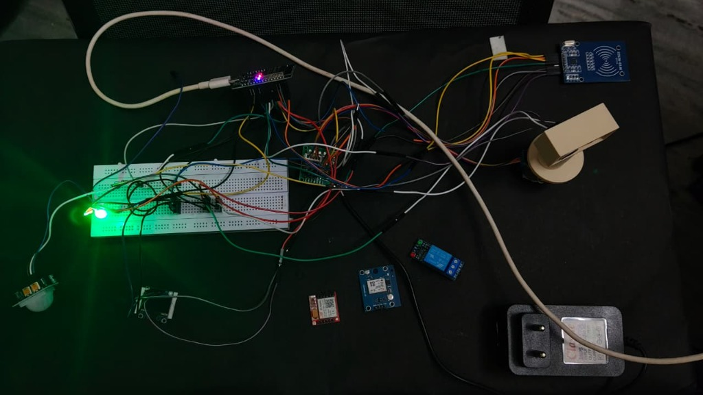
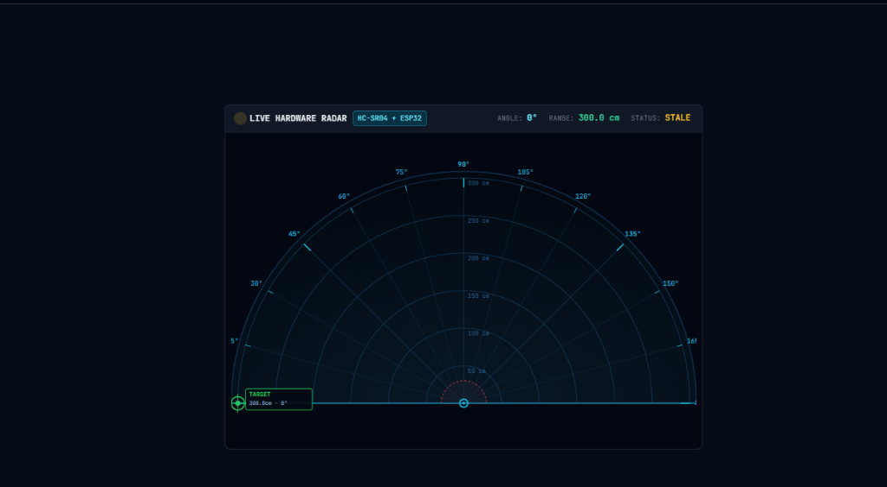

# Defence Sentinel — Adaptive RF/ESM & Hardware Radar Security System

[](https://www.sih.gov.in/)
[](hardware/defense_sentinel_hardware/defense_sentinel_hardware.ino)
[](https://developer.mozilla.org/en-US/docs/Web/API/Web_Serial_API)
[](https://nodejs.org/)
[](https://reactjs.org/)
[](https://www.typescriptlang.org/)
[](LICENSE)

> **SIH 2026 Problem Statement SIH26055**: *Adaptive Scan Strategy for Electronic Warfare & Tactical Perimeter Defence*  
> **Defence Sentinel** is a full-stack tactical defense platform combining **Physical Microcontroller Hardware (ESP32)**, **Real-time Web Serial Telemetry**, **Recency-Augmented UCB1 Multi-Armed Bandit Scheduling**, and a **7-Page Military Command & Control (C2) Suite**.

---

## 📷 Physical Hardware Prototype & Command Suite

| **Physical ESP32 Sensor & Scanner Hardware Setup** | **Tactical C2 Command Scope & Telemetry** |
| :---: | :---: |
|  |  |
| *0°–180° Stepper Radar Scanner with Ultrasonic Distance, PIR, RFID, OLED & RGB Indicators* | *Interactive 360° & Sector Tactical Radar, Target Kinematics, ESM & Threat Panels* |

---

## 📋 Table of Contents

- [Overview](#overview)
- [System Architecture](#system-architecture)
- [Hardware Prototype & Hardware Specifications](#hardware-prototype--hardware-specifications)
  - [Component Wiring & Pinout Table](#component-wiring--pinout-table)
  - [Web Serial Protocol Specification](#web-serial-protocol-specification)
  - [Dual Operational Modes](#dual-operational-modes)
- [Mathematical Engine — Recency-Augmented UCB1](#mathematical-engine--recency-augmented-ucb1)
- [7-Page Command & Control Suite](#7-page-command--control-suite)
- [Multi-Sensor Fusion & Threat Matrix](#multi-sensor-fusion--threat-matrix)
- [12-Step Guided Demonstration](#12-step-guided-demonstration)
- [Project Directory Layout](#project-directory-layout)
- [Quick Start & Hardware Setup Guide](#quick-start--hardware-setup-guide)
  - [1. ESP32 Firmware Flashing](#1-esp32-firmware-flashing)
  - [2. C2 Backend Server (Port 8080)](#2-c2-backend-server-port-8080)
  - [3. React Radar Scanner Frontend (Port 5173)](#3-react-radar-scanner-frontend-port-5173)
- [Verification & Automated Test Suite](#verification--automated-test-suite)
- [API Documentation](#api-documentation)
- [License & Disclaimer](#license--disclaimer)

---

## Overview

**Defence Sentinel** addresses the critical challenge of military spectrum and perimeter defense: traditional fixed or round-robin radar scanning fails against modern frequency-agile threats and multi-vector intrusions. 

This repository provides a complete, dual-layer solution:
1. **Physical Radar & Sensor Rig**: Built around an ESP32 microcontroller controlling a 180° sweeping stepper motor, HC-SR04 ultrasonic distance sensor, HC-SR501 PIR motion detector, MFRC522 RFID reader, SSD1306 OLED display, RGB alert LED, and Web Audio alert synthesizers communicating directly with the browser via the **Web Serial API**.
2. **C2 Command & Control Simulation Engine**: Powered by Node.js, WebSockets, and React 18, featuring dynamic Recency-Augmented UCB1 multi-armed bandit scheduling, synthetic RF spectrum analysis, multi-camera CV optical tracking, 4-layer sensor fusion, and statistical benchmarking.

---

## System Architecture

```
┌────────────────────────────────────────────────────────────────────────────────────────────────────────┐
│                                          DEFENCE SENTINEL                                              │
│                                                                                                        │
│  ┌────────────────────────────────────────────────┐     ┌───────────────────────────────────────────┐  │
│  │   PHYSICAL HARDWARE LAYER (ESP32 @ 115200)     │     │     C2 BACKEND SERVER (Node.js :8080)     │  │
│  │                                                │     │                                           │  │
│  │  - Stepper Motor (28BYJ-48 + ULN2003)          │     │  - Recency-Augmented UCB1 Band Scheduler │  │
│  │  - Ultrasonic Sensor (HC-SR04, 2cm-400cm)      │     │  - 25 Hz Kinematics Simulation Engine     │  │
│  │  - Motion Sensor (HC-SR501 PIR)                │     │  - Multi-Camera CV & Optical Context      │  │
│  │  - RFID Access Control (MFRC522 SPI)           │     │  - 4-Layer Sensor Fusion Correlation      │  │
│  │  - I2C OLED Display (SSD1306 128x64)           │     │  - Incident Management & Alert Dispatch   │  │
│  │  - RGB LED (Common Cathode Status)             │     │  - 5-Scenario Statistical Benchmark Engine│  │
│  └───────────────────────┬────────────────────────┘     └─────────────────────┬─────────────────────┘  │
│                          │                                                    │                        │
│                USB Web Serial API (COM / ttyUSB)                      WebSocket Stream                 │
│                          │                                                    │                        │
│                          ▼                                                    ▼                        │
│  ┌──────────────────────────────────────────────────────────────────────────────────────────────────┐  │
│  │                              REACT COMMAND DASHBOARD (Vite :5173)                                │  │
│  │                                                                                                  │  │
│  │  ┌──────────────────────────────────────────┐    ┌────────────────────────────────────────────┐  │  │
│  │  │   LIVE HARDWARE MODE (Web Serial Stream) │    │  C2 SIMULATION MODE (WebSocket Telemetry)  │  │  │
│  │  │   - 180° Physical Sector Radar Visual    │    │  - 360° Tactical Command Radar Scope       │  │  │
│  │  │   - Hysteresis Alarm Threshold (<50cm)   │    │  - 7-Page Full C2 Suite & Benchmark Visuals│  │  │
│  │  │   - Web Audio Rapid Beep Alert Synth     │    │  - Real-time RF Spectrogram & Waterfall    │  │  │
│  │  └──────────────────────────────────────────┘    └────────────────────────────────────────────┘  │  │
│  └──────────────────────────────────────────────────────────────────────────────────────────────────┘  │
└────────────────────────────────────────────────────────────────────────────────────────────────────────┘
```

---

## Hardware Prototype & Hardware Specifications

The physical prototype is engineered to provide precise physical sector scanning and real-time obstacle telemetry to the C2 frontend.

### Component Wiring & Pinout Table

| Hardware Subsystem | Component Details | ESP32 GPIO Pin | Protocol / Signal |
|---|---|---|---|
| **Motor Drive** | 28BYJ-48 Stepper + ULN2003 Driver | `IN1: GPIO 14`, `IN2: GPIO 27`<br>`IN3: GPIO 26`, `IN4: GPIO 33` | 4-Step Half/Full Sequence |
| **Ultrasonic Distance** | HC-SR04 Acoustic Sensor | `TRIG: GPIO 5`<br>`ECHO: GPIO 18` | Microsecond Timing Pulse |
| **Motion Detector** | HC-SR501 PIR Sensor | `DATA: GPIO 16` | Digital High/Low Input |
| **RFID Reader** | MFRC522 SPI Transceiver | `SDA: GPIO 4`, `SCK: GPIO 25`<br>`MOSI: GPIO 23`, `MISO: GPIO 17`<br>`RST: GPIO 32` | SPI Bus (`SPI.begin(25,17,23,4)`) |
| **OLED Display** | SSD1306 0.96" 128x64 | `SDA: GPIO 21`<br>`SCL: GPIO 22` | I2C Bus (`0x3C`) |
| **RGB Alert LED** | Common Cathode Tricolor LED | `RED: GPIO 15`, `GREEN: GPIO 2`, `BLUE: GPIO 0` | Active High PWM / Digital |
| **Web Alert Sound** | Web Audio API Engine | Laptop Speakers | Synthesized 1.2kHz Beep Wave |

### Web Serial Protocol Specification

The ESP32 streams raw ASCII telemetry formatted as line-delimited key-value strings over USB Serial at **115200 baud (8N1)**:

* `READY` — Firmware boot signal and hardware self-test complete.
* `DATA <angle> <distance>` — Normal scan payload (e.g., `DATA 45 38` = 45° angle, 38cm distance).
* `ALERT <angle> <distance>` — Distance dropped below **50 cm** (Triggers RED LED, OLED ALERT layout, and web audio beep).
* `CLEAR` — Threat distance cleared past **55 cm** hysteresis limit (Restores GREEN LED and normal scan).
* `RFID <uid>` — Card detected by MFRC522 scanner.

### Dual Operational Modes

The user interface allows instant switching between two distinct modes via header toggle controls:
1. **LIVE HARDWARE MODE**: Connects directly to the ESP32 via Chrome/Edge Web Serial API. Renders real-time physical sweep angle, target distance, motion state, RFID card logs, and activates browser Web Audio alerts.
2. **C2 SIMULATION MODE**: Connects via WebSockets to the Node.js C2 backend, feeding off synthetic 25Hz multi-sensor simulation data across 7 canonical threat entities.

---

## Mathematical Engine — Recency-Augmented UCB1

**Core Implementation:** [`defense_radar_system/server/scheduler_engine.js`](file:///a:/Amar/Work/SIH/Defence-Sentinel-main/Defence-Sentinel-main/defense_radar_system/server/scheduler_engine.js)

Standard Upper Confidence Bound (UCB1) algorithms assume stationary reward distributions. In Electronic Warfare (EW), threat emitters hop frequencies dynamically and emit short bursts. To guarantee fast re-observation of frequency-agile threats without starving unvisited bands, our algorithm introduces a non-stationary **recency-augmentation term**.

### Composite Score Formula

The band selection score $Q(b)$ for candidate frequency band $b$ at time $t$ is defined by:

$$Q(b) = \hat{\mu}_b + c \cdot \sqrt{\frac{\ln N}{N_b}} + \lambda \cdot \tanh\!\left(\frac{\Delta t_b}{\tau}\right)$$

Where:
- $\hat{\mu}_b = \frac{\alpha_b}{\alpha_b + \beta_b}$: Bayesian posterior mean detection probability computed from dynamic Beta distributions.
- $c \cdot \sqrt{\frac{\ln N}{N_b}}$: Standard UCB exploration term ($c = \sqrt{2} \approx 1.414$, $N$ total dwells, $N_b$ dwells on band $b$).
- $\lambda \cdot \tanh\!\left(\frac{\Delta t_b}{\tau}\right)$: **Recency augmentation penalty/boost** ($\lambda = 0.20$, aging constant $\tau = 5.0\text{ s}$, $\Delta t_b$ elapsed time since band $b$ was last scanned).

---

## 7-Page Command & Control Suite

| # | Page Name | Primary Capability & Key Features |
|:---:|---|---|
| **1** | **Tactical Context** | 360° rotating sweep radar, sector scanning, 7 canonical tracks with kinematic movement, 450m breach warning perimeter, personnel access authorization panel. |
| **2** | **RF / ESM** | Dynamic RF spectrum visualizer, 75-row waterfall spectrogram, live receiver telemetry (frequency, bandwidth, SNR, power), RF burst timeline. |
| **3** | **Optical Context** | 4 switchable surveillance cameras (CAM-01 to CAM-04), synthetic infrared thermal canvas rendering, CV object bounding boxes, camera correlation panel. |
| **4** | **Sensor Fusion** | Multi-sensor correlation matrix combining Radar + Optical + RF + RFID evidence layers into unified threat confidence scores. |
| **5** | **Adaptive Scheduler** | Band state table, 24-dwell hit/miss history bar, Bayesian Beta distribution curve visualization, priority comparison ranking, and 4 scheduler ablation toggles. |
| **6** | **Analytics & Benchmark** | 6 verified metrics (Detection Rate, Latency, FAR, Accuracy, Utilization, Sensitivity), 5-scenario statistical benchmark suite, CSV/JSON report exports. |
| **7** | **Simulation Center** | Execution controls (Pause, Resume, Step, Reset), speed multipliers (1x, 2x, 5x), live JSON stream inspector, 12-step guided automated demonstration. |

---

## Multi-Sensor Fusion & Threat Matrix

| Entity ID | Entity Type | Classification | Fusion Status & Description |
|---|---|---|---|
| **TRK-014** | PERSON | ✅ VERIFIED | Lt. R. Sharma (TAG-ALPHA-01) — Authorized Friendly Patrol |
| **TRK-007** | PERSON | ✅ VERIFIED | Sep. K. Patel (TAG-CHARLIE-01) — Base Maintenance Staff |
| **TRK-042** | PERSON | ✅ VERIFIED | Hav. D. Singh (TAG-BRAVO-02) — Perimeter Watchman |
| **TRK-033** | VEHICLE | ✅ VERIFIED | Quick Reaction Team Vehicle 4 (TAG-VEHICLE-04) |
| **TRK-021** | PERSON | 🔴 ANOMALOUS | **Perimeter Intruder** — Unmatched tag inside 450m restricted zone |
| **TRK-055** | ANOMALOUS_OBJECT | 🔴 ANOMALOUS | Unknown drone/quadcopter emitting burst RF telemetry |
| **TRK-019** | WILDLIFE | 🟡 WILDLIFE | Non-threatening fauna movement near outer fence |

---

## 12-Step Guided Demonstration

The platform includes an automated 12-step tactical demonstration available directly in the Simulation Control Center:

1. **Step 1**: Baseline Tactical Monitoring initialized.
2. **Step 2**: Primary radar track detection established.
3. **Step 3**: Camera handoff and optical correlation engaged.
4. **Step 4**: Procedural infrared thermal feed locks onto perimeter sector.
5. **Step 5**: RF emitter detection and signal burst logged in ESM queue.
6. **Step 6**: Multi-sensor fusion engine correlates 4 evidence layers.
7. **Step 7**: Threat anomaly identified for TRK-021.
8. **Step 8**: Recency UCB1 scheduler shifts to agile band tracking.
9. **Step 9**: Dwell time automatically allocated to active threat frequency.
10. **Step 10**: Simulated security alert generated and logged.
11. **Step 11**: Quick Reaction Team (QRT) dispatch trigger sent.
12. **Step 12**: Operational state confirms `ANOMALY VERIFICATION ENGAGED`.

---

## Project Directory Layout

```
Defence-Sentinel/
├── docs/
│   └── assets/
│       ├── hardware_prototype.jpg   # Physical ESP32 Hardware Photo
│       └── radar_dashboard.png      # C2 Tactical Radar Screenshot
│
├── hardware/
│   └── defense_sentinel_hardware/
│       └── defense_sentinel_hardware.ino  # Complete ESP32 C++ Firmware
│
├── defense_radar_system/            # Module 1 — Node.js C2 Server & Dashboard
│   ├── server.js                    # Express + WebSocket Application Entry
│   ├── package.json
│   ├── server/                      # Engine Subsystems
│   │   ├── scheduler_engine.js      # Recency UCB1 Scheduler (CORE)
│   │   ├── benchmark_runner.js      # 5-Scenario Statistical Engine
│   │   ├── incident_engine.js       # Alert & Security Incident Logging
│   │   └── prng.js                  # Mulberry32 Deterministic PRNG
│   ├── public/                      # Tactical Command Dashboard SPA
│   └── test/                        # 13 Automated Test Suites (A–M)
│
├── radar-scanner/                   # Module 2 — React Radar Scanner Frontend
│   ├── src/
│   │   ├── App.tsx                  # Root Container & Mode Switcher
│   │   ├── components/              # Tactical & Hardware Scope Components
│   │   │   ├── HardwareRadarScope.tsx # 180° Hardware Sector Scope
│   │   │   ├── RadarScope.tsx       # 360° Simulation Radar Scope
│   │   │   └── AlertsPanel.tsx
│   │   └── hooks/
│   │       ├── useHardwareSerial.ts # Web Serial API & Sound Synth
│   │       └── useC2Backend.ts      # WebSocket Telemetry Stream
│   ├── package.json
│   └── vite.config.ts
│
└── README.md
```

---

## Quick Start & Hardware Setup Guide

### 1. ESP32 Firmware Flashing

1. Open `hardware/defense_sentinel_hardware/defense_sentinel_hardware.ino` in the Arduino IDE.
2. Select **Board**: `ESP32 Dev Module` and set baud rate to `115200`.
3. Install dependencies via Library Manager:
   - `Adafruit SSD1306` & `Adafruit GFX Library`
   - `MFRC522` by RFIDRead
4. Connect ESP32 via USB and click **Upload**.

### 2. C2 Backend Server (Port 8080)

```bash
cd defense_radar_system
npm install
node server.js
```
* Access C2 Command Dashboard at: **`http://localhost:8080`**

### 3. React Radar Scanner Frontend (Port 5173)

In a second terminal window:

```bash
cd radar-scanner
npm install
npm run dev -- --host
```
* Access React Radar Scanner at: **`http://localhost:5173`**
* Click **CONNECT HARDWARE** to pair with the ESP32 over Web Serial API, or toggle to **C2 SIMULATION** for full system testing.

---

## Verification & Automated Test Suite

Run the full suite of **13 Automated Acceptance Test Suites (Suites A to M)**:

```bash
cd defense_radar_system
node test/run_all_tests.js
```

### Test Suite Execution Summary

| Suite ID | Subsystem Tested | Verification Status |
|:---:|---|:---:|
| **Suite A** | PRNG Mulberry32 Seeded Determinism | ✅ PASS |
| **Suite B** | Recency UCB1 Mathematical Formula Output | ✅ PASS |
| **Suite C** | Bayesian Beta Posterior Distribution Updates | ✅ PASS |
| **Suite D** | Unvisited Frequency Exploration Guarantee | ✅ PASS |
| **Suite E** | Stationary Environment Bandit Convergence | ✅ PASS |
| **Suite F** | Deterministic Replay Verification | ✅ PASS |
| **Suite G** | Metric Calculations & Brier Score Validation | ✅ PASS |
| **Suite H** | Single Source of Truth Entity Synchronization | ✅ PASS |
| **Suite I** | 5-Scenario Comprehensive Benchmark Engine | ✅ PASS |
| **Suite J** | Adaptive Learning Loop & Causal Decision Trace | ✅ PASS |
| **Suite K** | Robustness Engine & Failure-Injection Suite | ✅ PASS |
| **Suite L** | Security Alert & Incident Engine Logging | ✅ PASS |
| **Suite M** | Phase 3 RF Telemetry & C2 WebSocket Sync | ✅ PASS |

---

## API Documentation

| Endpoint | Method | Response / Action Description |
|---|---|---|
| `/api/status` | `GET` | Snapshot of current system status, mode, and health badges |
| `/api/sitrep` | `GET` | Formatted military situation report (SITREP) |
| `/api/entities` | `GET` | Array of all 7 threat entities with fused sensor telemetry |
| `/api/analytics` | `GET` | Real-time scheduler metrics (Detection rate, FAR, Latency) |
| `/api/benchmark/suite` | `POST` | Executes full 5-scenario statistical benchmark run |
| `/api/benchmark/export?format=json` | `GET` | Exports benchmark results as raw JSON |
| `/api/benchmark/export?format=csv` | `GET` | Exports benchmark results as structured CSV |
| `/api/benchmark/export?format=report` | `GET` | Exports formatted text benchmark audit report |
| `/api/incidents` | `GET` | History of logged security incidents and alert traces |
| `/api/reset` | `POST` | Resets simulation time and re-seeds canonical entities |

---

## License & Disclaimer

This software system and prototype were created for the **Smart India Hackathon 2026** under Problem Statement **SIH26055** (*Adaptive Scan Strategy for Electronic Warfare*).

- All radar signals, optical feeds, RF spectra, and target paths are synthetic simulations.
- Not intended for direct operational or tactical military deployment without hardware integration qualification.

**License**: Distributed under the [MIT License](LICENSE).
